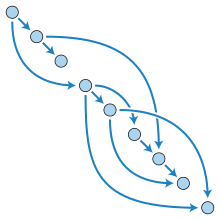

ReferenceClasses
========================================================
author: Rob Bennetto and Eckhard Briedenhann
date: 2019-04-06
autosize: true

Introduction
========================================================

Chalcid


SatRday
========================================================
incremental: true

- What to wear?
  - Normal clothes?
  - Formal clothes?
  - Zebra suit?

- Fit in with other responsibilities 
 - Will there be enough time?
 - How long will it take?

========================================================
type: prompt
transition-speed: slow


How do we over engineer this?
========================================================
incremental: true

What do we need?


TODO: Need a graph for this

StateA  --->     StateB  --->     StateC


Process:
* Assign weights to the transitions
* And calculate what the boundries of the states as a whole are


Rob's face
========================================================


Directed Acyclic Graphs (aka DAGs)
========================================================

* Nodes (Vertices)
* Directed Edges ( pairs of nodes)
* No Cycles




Representation problem
========================================================
incremental: true

Object Orientated Programming:
```{ width = "50%"}
// Vector object
class Node {
  public:
    Node(int id):id(id){}
    int id;
};

class DAG {
  public:
  
  DAG(int size) : adjList(size){}
  
  void addEdge(Node* from, Node* to){
    adjList[from->id].push_back(to);
  }
  std::vector<*Node> adjList; 
};

// Init nodes
Node n1(1); 
Node n2(2); 
Node n3(3); 

// 1 --> 2 --> 3
graph.AddEdge(&n1, &n2);
graph.AddEdge(&n2, &n3);
```
***

R:
```
// Helper function

getID <- function(node){
  paste0("v",node$id)
}

# Create Nodes

n1 <- list(id = 1)
n2 <- list(id = 2)
n3 <- list(id = 3)

# 1 --> 2 --> 3
graph[[getID(n1)]] <- list(n2)
graph[[paste0(n2)]] <- list(n2)
```


========================================================


Why does this smell funny?
========================================================

* **No typing** - live in the wild west
* **No abstraction** - very verbose 


Object Orientated Programming in R
========================================================
incremental: true

S3 Classes:

```r
n1 <- list(id = 1)

class(n1) <- "node"

print.node <- function(obj){
  
  cat("Class:",class(obj),
      "\nID:",obj$id)
}
print(n1)
```

```
Class: node 
ID: 1
```
***

S4 Classes:

```r
node <- setClass("node", slots=list(id="numeric"))

n1 <- node(id = 1)

print.node <- function(obj){
  
  cat("Class:",class(obj),
      "\nID:",obj@id)
}
print(n1)
```

```
Class: node 
ID: 1
```

Reference Classes
========================================================


```r
node <- setRefClass("nodeR", fields = list(id = "numeric"), 
                     methods = list(
                       show = function(){
                          cat("Node\nID:",id,"\n")
                       }
                     ))
n1 <- node(id = 1)

print(n1)
```

```
Node
ID: 1 
```


Benefits:

* Unlike S3 and S4 methods belong to class
* Able to have pointer like functionality
* Powerful abstraction layer


========================================================


Let's get this party starting?
========================================================


