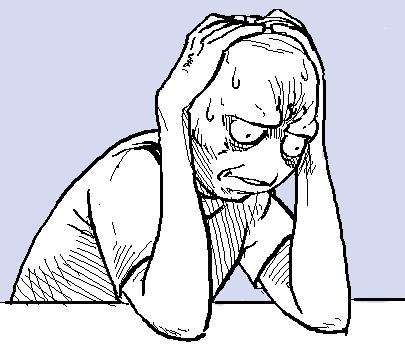
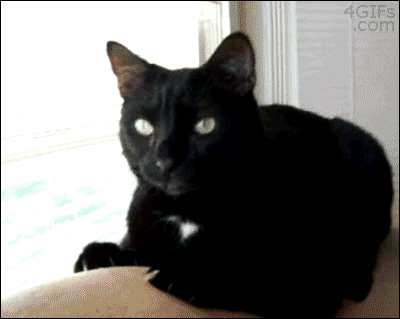
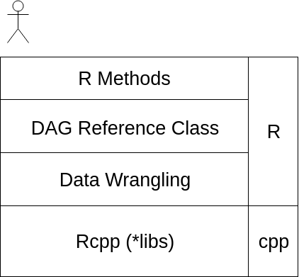

ReferenceClasses
========================================================
author: Rob Bennetto and Eckhard Briedenhann
css : chalcid.css
width: 1920
height: 1080
date: 2019-04-06 
autosize: true


========================================================
incremental: true

<div align="center">
</img>
</div>

 - Distributor of Icepack services
 - Consulting and Ops Research in Africa
 - Insurance and Logstics

 
========================================================


SatRday
========================================================
incremental: true


- What do we wear?
  - Normal clothes?
  - Formal clothes?
  - Zebra suit?

- How do we fit it in with all of our other responsibilities?
 - Will there be enough time?
 - How long will it take?
 
 - What do we do first?
  - Create presentation?
  - Code up something interesting and hope the presentation self-materialises?
  - Go find a corner to cry in?

***



How do we over engineer this?
========================================================
incremental: true

What do we need?

- A way to represent a **state** of being
- A way to represent the **transitions** between states as well as their attributes (*time, awesomeness-factor, etc.*)
- **Algorithms** to calculate the the optimal set of state to traverse


Graph?
========================================================


Graph?
========================================================
incremental: true


Process:
* Assign weights to the transitions
* And calculate what the boundries of the states as a whole are


Rob's face
========================================================


DAGs
========================================================

DAGs
========================================================
incremental: true

**Directed Acyclic Graphs (aka DAG)**

* Nodes (Vertices)
* Directed Edges ( pairs of nodes)
* No Cycles


Representation problem
========================================================
incremental: true

Nodes:

```r
nodes <- list(n1 = list(id = 1),
            n2 = list(id = 2),
            n3 = list(id = 3), 
            n4 = list(id = 4))
```

Helper functions:

```r
getNodeID <- function(node){
  paste0("n",node$id)
}
```

***

Vectorised Graph:

```r
graph <- data.frame(From = c(1,1,2,3),
                    To = c(2,3,4,4))
```


```
  From To
1    1  2
2    1  3
3    2  4
4    3  4
```


List Graph:

```r
graph <- list()
graph[[getNodeID(n1)]] <- list(n2,n3)
graph[[getNodeID(n2)]] <- list(n4)
graph[[getNodeID(n3)]] <- list(n4)
```

```
$n1
$n1[[1]]
$n1[[1]]$id
[1] 2


$n1[[2]]
$n1[[2]]$id
[1] 4


$n2
$n2[[1]]
$n2[[1]]$id
[1] 4


$n4
$n4[[1]]
$n4[[1]]$id
[1] 4
```


========================================================



Why does this smell funny?
========================================================
incremental: true

* **No typing** - live in the wild west
* **No standard** - reinventing the wheel one line at a time
* **No abstraction** - very verbose with a lot of index hunting

Why does this smell funny?
========================================================

* **No typing** - live in the wild west
* **No standard** - reinventing the wheel one line at a time
* **No abstraction** - very verbose with a lot of index hunting


C++ World
========================================================
incremental: true

Object Orientated Programming:


Node Class:
```{ width = "50%"}
// Vector object
class Node {
  public:
    Node(int id):id(id){}
    int id;
};
```

Graph Class:
```

class DAG {
  public:
  
  DAG(int size) : adjList(size){}
  
  void addEdge(Node* from, Node* to){
    adjList[from->id].push_back(to);
  }
  std::vector<std::vector<*Node>> adjList; 
};
```

***
In practice:

```

// Init nodes
Node n1(1); 
Node n2(2); 
Node n3(3); 

// 1 --> 2 --> 3
graph.AddEdge(&n1, &n2);
graph.AddEdge(&n2, &n3);
```

Object Orientated Programming in R?
========================================================


Object Orientated Programming in R
========================================================
incremental: true

S3 Classes:

```r
n1 <- list(id = 1)

class(n1) <- "node"

print.node <- function(obj){
  
  cat("Class:",class(obj),
      "\nID:",obj$id)
}
print(n1)
```

```
Class: node 
ID: 1
```

**Benefits:**

* At least there is some kind of structure
* Class specific functions might be useful

Overall: 5/10

Object Orientated Programming in R
========================================================
incremental: true

S4 Classes:

```r
node <- setClass("node", slots=list(id="numeric"))

n1 <- node(id = 1)

print.node <- function(obj){
  
  cat("Class:",class(obj),
      "\nID:",obj@id)
}
print(n1)
```

```
Class: node 
ID: 1
```

**Benefits**:

* Typing
* Structured way of creating and interacting with object (even though you're using `@` instread of `$`)

Overall 8/10

Reference Classes (This is where you clap hands)
========================================================
incremental: true

Reference Classes:


```r
node <- setRefClass("nodeR", fields = list(id = "numeric"), 
                     methods = list(
                       show = function(){
                          cat("Node\nID:",id,"\n")
                       }
                     ))
n1 <- node(id = 1)

print(n1)
```

```
Node
ID: 1 
```

**Benefits**:

* Unlike S3 and S4 methods belong to class
* Able to have pointer like functionality
* Powerful abstraction layer

Overall 10/10 !


========================================================


Reference Classes: Under the hood
========================================================
incremental: true

Things to note:

- Under the hood:
  - A **S4** class
  - It's own **environment**
  


- Variables are **references** to underlying objects

***
Why worry?

Copying reference classes:

```r
n1 <- node(id = 1)
n1
```

```
Node
ID: 1 
```

Wrong way to copy:

```r
n2 = n1
n2$id <- 2
n1
```

```
Node
ID: 2 
```


Reference Classes: Under the hood
========================================================
incremental: true


Right way to copy:

```r
n2 <- n1$copy()
n2$id <- 2
n1
```

```
Node
ID: 1 
```


Let's get this party started!
========================================================
incremental: true

Create some reference classes.


```r
g<-dag()
g$load_from_file('classic_bst')
g$plot()
```

<div align="center">
<iframe src="bst_no_heirarchy.html" scrolling = "no" ></iframe>
</div>


Other projections
========================================================
incremental: true


```r
g$plot_heirarchy()
```
<iframe src="bst_heirarchy.html" scrolling = "no" ></iframe>

Highlight features
========================================================

```r
g$plot_heirarchy(colorRootLeaves = T)
```
<iframe src="bst_heirarchy_color.html" scrolling = "no" ></iframe>

Highlight features
========================================================

```r
g$plot(colorRootLeaves = T)
```
<iframe src="bst_no_heirarchy_color.html" scrolling = "no" ></iframe>

Modify the structure
========================================================

```r
g$plot_heirarchy(colorRootLeaves = T, turn = T)
```
<iframe src="bst_heirarchy_color_turn.html" scrolling = "no" ></iframe>

Modify the structure
========================================================

```r
g$close_graph()
g$plot_heirarchy(colorRootLeaves = T, turn = T)
```
<iframe src="proj_man_dag.html" scrolling = "no" ></iframe>

Some graph search
========================================================
incremental: true
We might be interested in a feature of the graph
- shortest paths
- critical paths
- min/max cut
- or other features


```r
g$shortest_path(g$root_nodes(), g$leaf_nodes())
```

<iframe src="proj_man_dag.html" scrolling="no"></iframe>
 
Some graph search
========================================================

```r
g$plot_heirarchy(T, T, g$shortest_path(g$root_nodes(), g$leaf_nodes()))
```
<iframe src="proj_man_dag_sp.html" scrolling = "no" ></iframe>

Some graph search
========================================================

```r
g$plot_heirarchy(T, T, g$critical_path(g$root_nodes(), g$leaf_nodes()))
```
<iframe src="proj_man_dag_cp.html" scrolling = "no" ></iframe>

Steady on
========================================================
incremental: true
You're right, that was too quick. What just happened?





Overkill?
========================================================
incremental: true

- No, just the right amount of kill.
- Don't reinvent the wheel
- Graphs can have multiple metrics/features
- Extracting features consistently for search is troublesome
- Which brings us to the Zebra suit.


Some graph search
========================================================
<iframe src="proj_man_dag_sp_free.html" scrolling = "no" ></iframe>

Some graph search
========================================================
<iframe src="proj_man_dag_cp_free.html" scrolling = "no" ></iframe>


Overengineering for the win
========================================================

The stack:
- Create **reference class** objects
  - Nodes
  - DAG
- Implement algorithms using **Rcpp**
  - Shortest path
  - Path with highest awesomeness value
- Visualise graphs using **d3** 
- BONUS ROUND: Create presentation using **RPres** 
- BONUS ROUND: Embed active charts

***


Let's get this party started?
========================================================
incremental: true


```r
g <- dag(vertexCount = 0)

awake <- g$newVertex(description = "Awake")
awake
```

```
State
Description: Awake 
ID: 0 
```

```r
dressedA <- g$newVertex(description = "DressedA")
dressedA
```

```
State
Description: DressedA 
ID: 1 
```

```r
dressedB <- g$newVertex(description = "DressedB")
dressedB
```

```
State
Description: DressedB 
ID: 2 
```

```r
getDressedA <- g$createTransition(from = awake,to = dressedA, weight = 1, description = "Getting pretty")
getDressedA
```

```
Edge
Description: Getting pretty 
Weight: 1 
From:
State
Description: Awake 
ID: 0 
To:
State
Description: DressedA 
ID: 1 
```

```r
getDressedB <- g$createTransition(from = awake,to = dressedB, weight = 0.5, description = "Getting cool")
```


In action
========================================================
incremental: true

State:

```r
state <- setRefClass("vertex", fields = list(id = "numeric", description = "character"), 
                     methods = list(
                       show = function(){
                          cat("State\nDescription:",description, "\nID:",id,"\n")
                       }
                     ))
```

Transition:

```r
transition <- setRefClass("edge", fields = list(from = "vertex", to = "vertex", weight = "numeric", description ="character"),
                          methods = list(
                            show = function(){
                              cat("Edge\nDescription:",description,"\nWeight:",weight, "\nFrom:\n")
                              from$show()
                              cat("To:\n")
                              to$show()
                            })
)
```


DAG:

```r
adjList <- setRefClass("adjList", fields = list(adjs = "list"),
                       methods = list(
                         addEdge = function(e){
                           if(!("edge" %in% class(e))){
                             stop("Cannot add non edge class to adjacency list")
                           }
                           vName <- paste0("v",e$from$id)
                           adjs[[vName]] <<- c(adjs[[vName]],e$to$id)
                           cat("Edge Added")
                         },
                         show = function(){
                           vNames <- names(adjs)
                           for(vN in vNames){
                            cat("Vertex:",vN,"\n")
                            cat("Adjs:",adjs[[vN]],"\n")
                           }
                         }
                       )
                       )

dag <- setRefClass("dag", fields = list( vertices = "list", edges = "list", adjList = "adjList", vertexCount = "numeric"),
                  methods = list(
                    newVertex = function(description){
                      v <- state(id = vertexCount, description = description )
                      vertexCount <<- vertexCount + 1
                      vertices <<- c(vertices,v)
                      return(v)
                    },
                    createTransition = function(from, to, weight, description){
                      
                      e <- transition(from = from, to = to, weight= weight, description = description)
                      edges <<- c(edges,e)
                      adjList$addEdge(e)
                      
                      return(e)
                    }
                  ))
```


